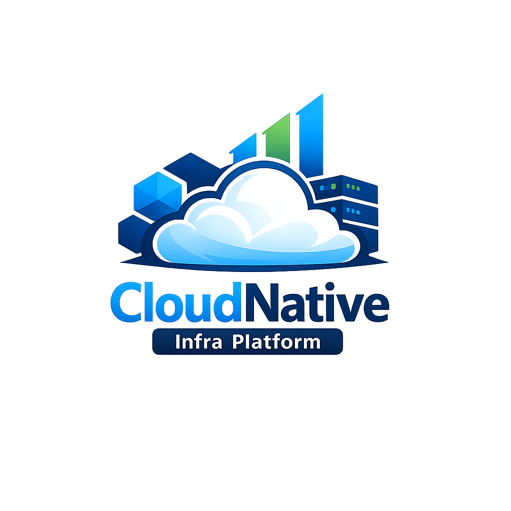
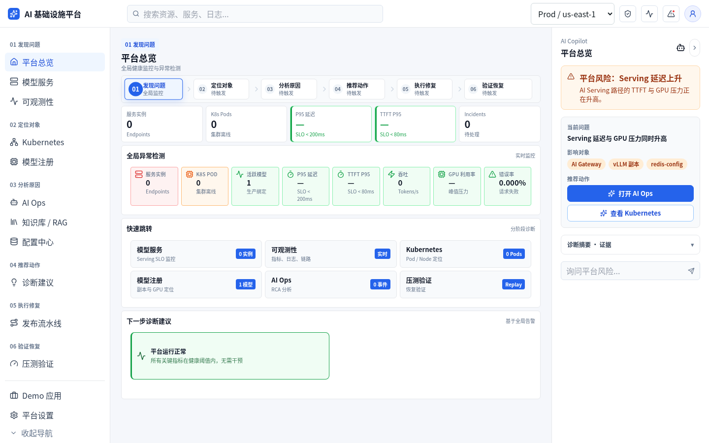
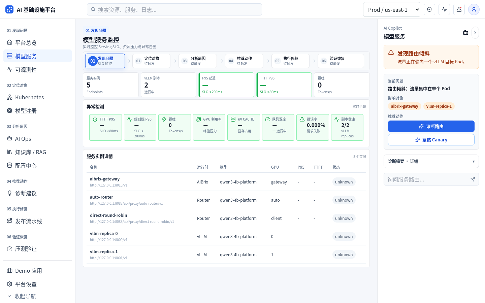
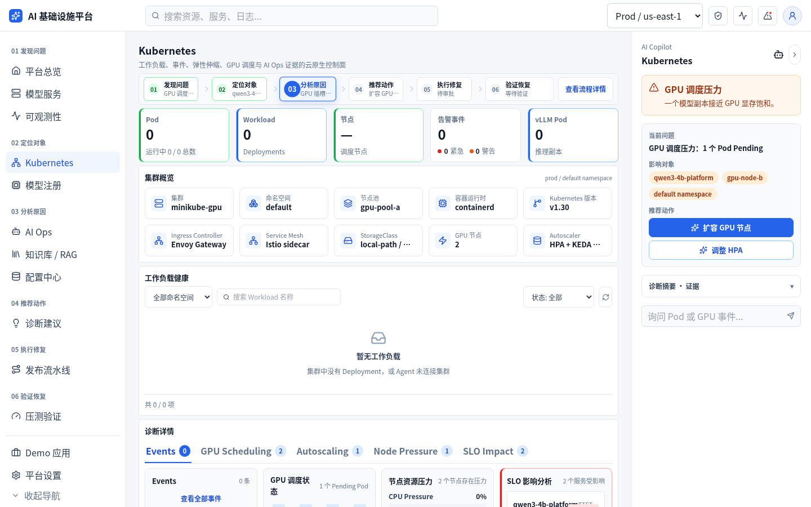
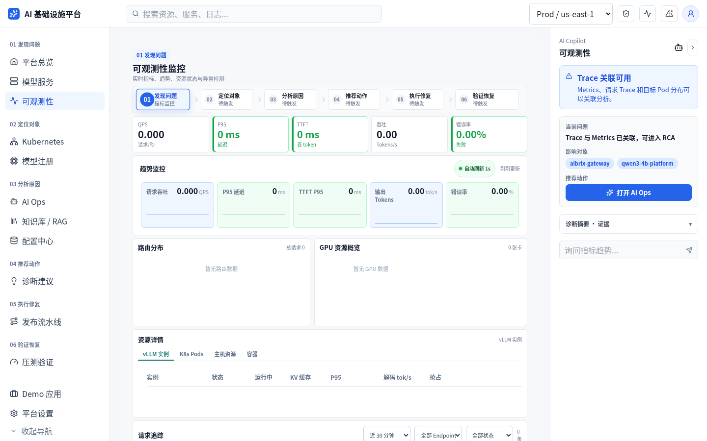
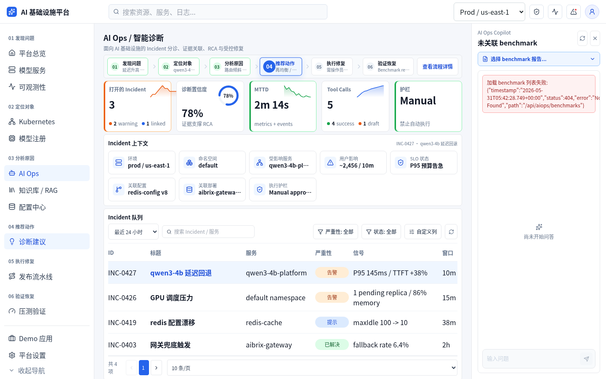
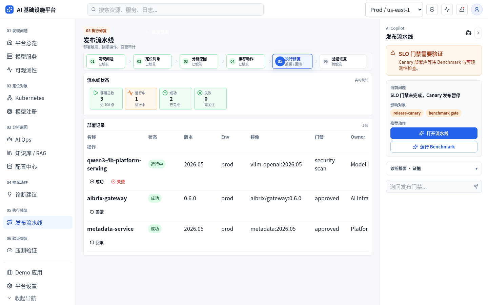
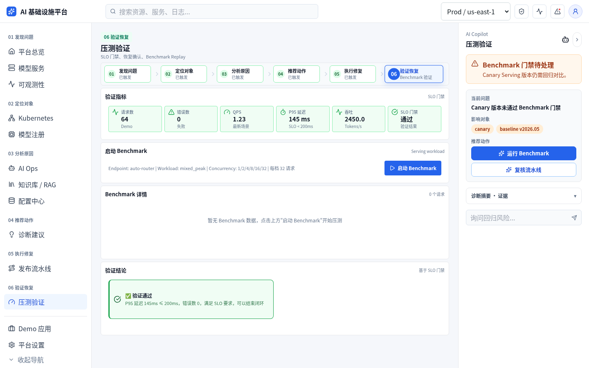

<p align="center">
  
</p>

<h1 align="center">Cloud-Native Infrastructure Management Platform（TwinForge）</h1>

[](https://github.com/heurry/TwinForge/actions/workflows/ci.yml)
[](LICENSE)


面向云原生微服务场景的分布式基础设施管理平台，提供配置管理、服务治理、可观测监控、CI/CD 自动化、弹性扩缩容和 AI 运维分析能力，支持平台工程师在统一控制台完成服务管理、资源观测、发布追踪和故障诊断。当前以单机双 RTX 3090 上的 LLM 训练与推理栈为主要实验场景：Qwen3.5-4B 的 LoRA/SFT 训练编排，Qwen3.6-27B FP8 / AWQ W4A16 版本的可复现 TTFT/TPOT 优化实验，模型服务经 Gateway / vLLM 统一接入平台治理。

> **项目状态**：推理侧已完成 DianJin 客服数据构建、27B-FP8 Profiling，以及 128 样本校准的 AWQ W4A16 转换与双卡 serving。AWQ 正式矩阵覆盖 1K/2K x 1--16 并发；共享前缀暖缓存口径下 Prefix Cache 使平均 P95 TTFT -70.0%、P95 TPOT -46.8%，保守首次复用口径下 1K/2K TTFT 分别 -30.4%/-64.7%，全部请求通过成功率与输出质量门禁。调度扫描保留 `8/4096`，TP1 和高活跃序列候选因 OOM 或 TPOT 退化被淘汰。AIOps 已接入推理与训练证据、vLLM 日志签名、规则归因和 Incident 关联。仓库不预填或伪造性能数字。
>
> 推理优化的任务边界、实验矩阵、阶段验收见 [`docs/INFERENCE-OPTIMIZATION-EXECUTION.md`](docs/INFERENCE-OPTIMIZATION-EXECUTION.md)。



当前项目采用 **Go-primary** 架构：React 控制台只对接 Go 控制面 API；Go 负责平台治理、PostgreSQL 数据、Kubernetes/Agent 访问、审计、可观测聚合，以及原生的知识库 RAG、压测 runner 和流式 Copilot；Python AI Service 仅提供结构化诊断与 LLM/Embedding 推理。Java 后端与 legacy Python 单体（`src/`）已全部退役，所有 `/api/*` 均由 Go 原生提供（或经 AI Service）。

## Architecture

```text
React / Vite Console
  -> Go Control Plane API (:8081)   ← single entry; every /api is Go-native
       ├─ Kubeflow PyTorchJob / datasets / model registry / training artifacts
       ├─ vLLM endpoints / DianJin benchmark matrix / TTFT / TPOT / quality gates
       ├─ Config / deployments / incidents / audit / metrics / platform overview
       ├─ Kubernetes snapshot via client-go + Go Agent (:8090)
       └─ /api/ai/* -> Python AI Service (:8200, diagnose + LLM/embed)

PostgreSQL (+ pgvector) stores control-plane data and RAG embeddings.
Redis backs cache / rate-limit / idempotency; MinIO holds benchmark & eval artifacts.
AIBrix / vLLM provide OpenAI-compatible model serving for AIOps and benchmark flows.
```

## 核心能力（四层）

### 基础管理层

- 配置中心：配置项创建、版本管理、发布回滚和审计追踪全链路落库，配置变更全程可追溯。
- 元数据管理：统一管理服务实例、部署记录、运行状态和故障事件等平台元数据；模型注册中心支持版本血缘、LoRA / 标签、训练产物归档与运行时实例绑定。
- 分层存储：Redis 热数据 + PostgreSQL 关系数据 + MinIO 对象存储；指标 / 审计按配置中心保留期自动归档 PG→MinIO，冷数据可预签名回环。
- 平台设置：API、Agent、AI Service 健康探测与本地配置编辑。

### 服务治理层

- 统一接入：微服务、模型服务和网关服务经同一注册中心接入——注册、心跳、注销、健康检查与 TTL reaper。
- 实例与路由：服务实例状态展示、Gateway / vLLM 路由信息查看，以及按 OTel span 派生的实时调用图（连线粗细 = 真实 QPS）。
- 调用指标：请求量、QPS、成功率等调用指标实时统计。
- 扩缩容管理：真实 scale + 建 / 删 HPA；写操作受 `ALLOW_K8S_WRITES` 与命名空间允许名单守卫（越权写返回 403）。

**模型服务场景**（服务治理的具体实例）：

- 训练微调：Kubeflow `PyTorchJob` 下发 Qwen3.5-4B LoRA/SFT 任务，跟踪状态、日志和训练产物并自动注册模型版本。
- 推理优化：面向 Qwen3.6-27B-FP8 与 AWQ W4A16 构建 1K/2K × 1--16 并发矩阵，采集 TTFT、TPOT、P95、吞吐、成功率、质量门禁和 GPU 快照。
- 性能归因：归档 PyTorch Profiler trace 和 vLLM iteration/MFU/KV 指标，定位双卡 PCIe NCCL all-reduce 与 3090 Marlin FP8 GEMM 为主要 kernel 瓶颈。
- 调度档位：AWQ 默认 `max_num_seqs=8,max_num_batched_tokens=4096`；`16/8192` 仅保留为 FP8 的高并发权衡档，AWQ 实测因 TPOT 退化未采纳。
- 实验数据：从 MIT 许可的 `DianJin/DianJin-CSC-Data` 生成固定 seed 的共享前缀压测集，记录 tokenizer、数据哈希和参考回复。
- 实验通道：训练微调与推理实验串行运行；训练页可提交/取消任务，推理页可分别启动/停止 vLLM 服务与压测任务，后端执行互斥校验。
- 瓶颈归因：按 prefill、decode、显存压力、调度饱和、稳定性和质量退化输出证据与下一轮参数建议。

### 可观测与发布层

- 平台总览：健康分、服务状态、活跃告警、集群 Pod 和关键指标聚合。
- 指标接入：节点、容器、服务实例、GPU 资源和请求链路统一接入（OTel + Tempo，一条 `/api/ai/chat:stream` 出 37-span 跨服务瀑布）。
- 统一展示：请求延迟、TTFT、错误率、吞吐和资源占用（主机 / GPU / cAdvisor / Kubernetes 快照）。
- CI/CD 与灰度发布：发布记录、Canary 状态、发布检查（SLO / Benchmark 门禁）和回滚入口；部署真改 Deployment 镜像并轮询滚动状态，坏镜像被 k8s `ProgressDeadlineExceeded` 检出后自动回滚上一版（零停机，2 条审计）。

### AIOps 分析层

- 知识资产分层管理：配置文件、模型文件、运行日志与诊断知识库（pgvector RAG；反馈重排默认关、可开关）。
- 故障诊断：结合 RAG、监控指标、配置变更和历史事件生成故障原因、影响范围、证据链和处理建议；支持 agentic 模式——LLM 经 vLLM 工具调用多轮自主取证后下结论。

## 真栈端到端联调（2026-06-08）

不止「能编译 / 有单测」——本平台已在**真 GPU serving 栈**（minikube + AIBrix + 2×vLLM Qwen3-4B）+ 真控制面 + 真 k8s 写 + 真可观测上，把每条闭环逐一跑通并留下机读证据：

- **CI/CD 真执行**：触发部署真改 Deployment 镜像 → 坏镜像被 k8s `ProgressDeadlineExceeded` 检出 → **自动回滚上一版**（零停机，2 条审计）。
- **弹性扩缩容真写**：真 scale + 真建/删 HPA；命名空间 + serving 名守卫对越权写返回 403。
- **AI 诊断真 agentic**：Qwen3-4B 经 vLLM 工具调用发起**多轮 tool_calls** 自主取证后下结论。
- **RAG 闭环 + 反馈重排 A/B**：live 流式问答（答案精确复述 benchmark 实测数值）→ 👍 反馈 → recall@k 评测；开启反馈重排后被赞文档真实上浮。
- **分层存储生命周期**：9129 行 / ~118 MiB 真实遥测 PG→MinIO 归档，冷数据可预签名回环。
- **全链路 trace**：一条 `/api/ai/chat:stream` 在 Tempo 出 37-span 跨服务瀑布。
- **helm 自托管**：`helm install` 进 minikube，go-server 多副本自迁移 fresh DB 后 `/api/health` ok。
- 期间真实发现并修复 1 个 live-path bug（agent `tools:null` → Pydantic 422）。

> 串讲见 **[`docs/E2E-WALKTHROUGH.md`](docs/E2E-WALKTHROUGH.md)**，逐条原始输出在 **[`docs/e2e-evidence/`](docs/e2e-evidence/)**。

## 界面预览

| 服务治理 | 集群快照 |
| --- | --- |
|  |  |
| **可观测监控** | **AI Ops** |
|  |  |
| **发布流水线** | **压测门禁** |
|  |  |

> 更多页面截图见 [`docs/images/`](docs/images/)（知识库 / 模型注册 / 配置中心 / 演示应用 / 设置）。

## 仓库结构

```text
apps/web/          React/Vite 控制台
server/            Go 控制面 API（单一入口，全部 /api 原生）
agent/             Go Node/Kubernetes 采集代理
apps/ai-service/   Python AI 诊断与 LLM/Embedding 服务
configs/serve/     vLLM / AIBrix / 模型服务配置
deploy/            compose、Helm、AIBrix、observability 部署文件
scripts/           AIBrix/vLLM 服务层与一键启动脚本
docs/              当前平台设计、部署和归位说明
docs/images/       控制台各页面截图
```

## 快速开始

### 1. 启动后端控制面

```bash
docker compose -f deploy/compose/docker-compose.yml up -d --build
```

Compose 会启动：

- PostgreSQL (+ pgvector) `:5432`
- Redis `:6379`、MinIO `:9000/:9001`
- Go control plane `:8081`
- Python AI Service `:8200`
- Go Agent `:8090`

Go Agent 通过只允许固定镜像、模型路径和参数集的 Docker Engine API 管理 Qwen3.6 推理 workload；Compose 会挂载 `/var/run/docker.sock`，仅建议在本机受信环境使用。

> 这一步即可独立运行：AI 服务回退 stub、k8s / 指标链路降级，不阻塞启动。需要真实模型推理见下方「3. 完整本地栈」——届时改用 `scripts/run_full_stack.sh` 拉起 Go 应用层（内置启动顺序预检）。

### 2. 启动前端控制台

```bash
cd apps/web
npm install
npm run dev
```

默认访问：

- Web UI: `http://127.0.0.1:5173`
- Go API health: `http://127.0.0.1:8081/api/health`
- Python AI health: `http://127.0.0.1:8200/internal/health`

### 3. 完整本地栈（含 GPU 推理，可选）

本机具备 minikube、NVIDIA runtime、AIBrix、vLLM 与模型权重（`model/Qwen3.5-4B/`）时，可拉起真实推理链路。**启动顺序很重要——必须先推理层、后应用层**：

```bash
# 1) 先起推理层：minikube + AIBrix + vLLM(Qwen3.5-4B) + cAdvisor；AIBrix 网关 → 127.0.0.1:8010
bash scripts/run_aibrix_4b_stack.sh

# 2) 再起 Go 应用层 + 前端
bash scripts/run_full_stack.sh

# 3) 确认网关在服务（应列出 qwen3-4b-customer）
curl -s http://127.0.0.1:8010/v1/models
```

网关就绪后，AI Copilot 会从 stub 自动切到真实流式推理（ai-service `AI_STUB_MODE=auto` 每条消息重试 live，无需重启前端）。

> **为什么顺序不能反**：go-server 接入 `minikube` 外部网络以直达集群 API（`192.168.49.2:8443`）。若 minikube 未运行时先起应用层，Docker 会把 minikube 保留的 `192.168.49.2` 分给 go-server，之后 `minikube start` 报 `Address already in use`。两个脚本都内置预检，会**快速失败并给出修复指引**：
> - `run_full_stack.sh`：minikube 容器存在但未运行时拒绝启动；无 GPU 仅跑应用层降级模式时用 `ALLOW_MINIKUBE_DOWN=1` 覆盖。
> - `run_aibrix_4b_stack.sh`：`192.168.49.2` 被非 minikube 容器占用时拒绝启动，提示先 `docker compose -f deploy/compose/docker-compose.yml down`。

## 开发验证

Frontend:

```bash
cd apps/web
npm run build
```

Go control plane:

```bash
cd server
go test ./...
```

Go agent:

```bash
cd agent
go test ./...
```

Python legacy API:

```bash
pip install -r requirements.txt
pytest tests/ -q
```

Python AI Service:

```bash
cd apps/ai-service
pip install -r requirements.txt
pytest tests/ -q
```

## 贡献与社区

- 贡献指南：[CONTRIBUTING.md](CONTRIBUTING.md)
- 行为准则：[CODE_OF_CONDUCT.md](CODE_OF_CONDUCT.md)
- 安全漏洞报告：[SECURITY.md](SECURITY.md)（请勿提交公开 issue）
- 变更记录：[CHANGELOG.md](CHANGELOG.md)

欢迎通过 Issue / Pull Request 参与。提交前请阅读贡献指南并确保相关构建与测试通过。

## 许可证

本项目基于 [Apache License 2.0](LICENSE) 开源。
