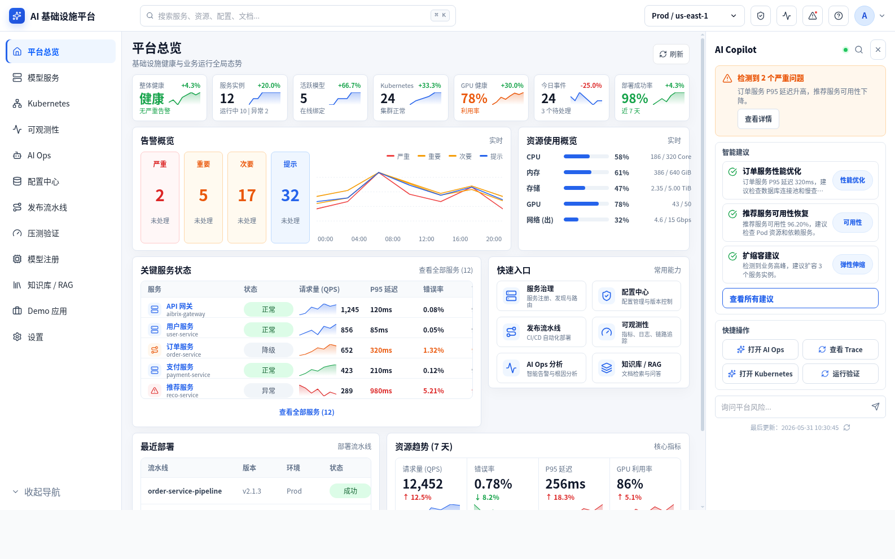

# CloudNative Infra Platform

面向云原生微服务场景的分布式基础设施管理平台，统一提供配置中心、服务治理、元数据管理、可观测监控、CI/CD 自动化、弹性扩缩容、分层存储与 AI 运维分析能力。



当前项目采用 **Go-primary** 架构：React 控制台只对接 Go 控制面 API；Go 负责平台治理、PostgreSQL 数据、Kubernetes/Agent 访问、审计和可观测聚合；Python AI Service 提供结构化诊断与 Copilot 推理；legacy Python API 仅保留知识库、压测和演示工作负载的迁移期能力。

## Architecture

```text
React / Vite Console
  -> Go Control Plane API (:8081)
       ├─ Config / deployments / incidents / audit / metrics / platform overview
       ├─ Kubernetes snapshot via Go Agent (:8090)
       ├─ /api/ai/* -> Python AI Service (:8200)
       └─ legacy service facade -> Python API (:8088)

PostgreSQL stores platform control-plane data.
AIBrix / vLLM provide OpenAI-compatible model serving for AIOps and benchmark flows.
```

## 核心能力

- 平台总览：健康分、服务状态、活跃告警、集群 Pod 和关键指标聚合。
- 配置中心：配置项、版本发布、回滚和审计链路。
- 服务治理：模型服务实例、运行时健康、Gateway / vLLM 路由状态。
- 发布流水线：发布记录、Canary 状态、回滚入口和 SLO / Benchmark 门禁。
- 可观测监控：请求延迟、TTFT、吞吐、主机资源、GPU、cAdvisor 和 Kubernetes 快照。
- 知识库 / RAG：文档导入、检索、索引重建和业务 Demo 问答。
- AI Ops：Go 聚合证据，Python AI Service 生成根因、影响面、证据和建议动作。
- 设置页：API、Agent、AI Service、Legacy Proxy 健康探测和本地配置编辑。

## 仓库结构

```text
apps/web/          React/Vite 控制台
server/            Go 控制面 API
agent/             Go Node/Kubernetes 采集代理
apps/ai-service/   Python AI 诊断与 Copilot 服务
src/api/           legacy Python facade，承接知识库、压测和 Demo API
src/customer_support/
src/jobs/
src/metrics/
src/rag/
src/serve/         Python 侧服务调用与系统快照辅助
configs/app/       应用运行配置
configs/serve/     vLLM / AIBrix / 模型服务配置
deploy/            compose、AIBrix、observability 部署文件
docs/              当前平台设计、部署和归位说明
screenshots/       前端样例、复刻和后端联调截图
```

## 快速开始

### 1. 启动后端控制面

```bash
docker compose -f deploy/compose/docker-compose.yml up -d --build
```

Compose 会启动：

- PostgreSQL `:5432`
- Go control plane `:8081`
- Python AI Service `:8200`
- Go Agent `:8090`

迁移期 legacy Python API 可以单独启动：

```bash
bash scripts/serve_api.sh
```

### 2. 启动前端控制台

```bash
cd apps/web
npm install
npm run dev
```

默认访问：

- Web UI: `http://127.0.0.1:5173`
- Go API health: `http://127.0.0.1:8081/api/health`
- Python AI health: `http://127.0.0.1:8200/internal/health`

### 3. 可选本地栈

本机已有 minikube、NVIDIA runtime、AIBrix 和 vLLM 环境时，可以使用：

```bash
bash scripts/run_aibrix_4b_stack.sh
```

该脚本会启动 AIBrix/vLLM 服务、端口转发、cAdvisor、legacy API、前端和基础冒烟检查。

## 开发验证

Frontend:

```bash
cd apps/web
npm run build
```

Go control plane:

```bash
cd server
go test ./...
```

Go agent:

```bash
cd agent
go test ./...
```

Python legacy API:

```bash
pip install -r requirements.txt
pytest tests/ -q
```

Python AI Service:

```bash
cd apps/ai-service
pip install -r requirements.txt
pytest tests/ -q
```
